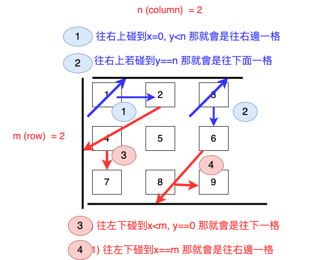

# 498. Diagonal Traverse

Given a matrix of M x N elements (M rows, N columns), return all elements of the matrix in diagonal order as shown in the below image.

Example:
```
Input:
[
 [ 1, 2, 3 ],
 [ 4, 5, 6 ],
 [ 7, 8, 9 ]
]

Output:  [1,2,4,7,5,3,6,8,9]
```


## 我的作法

先用 x=0,y=0 紀錄目前所在的位置，然後根據下圖判斷要移動的規則為何




### Cpp

```cpp=
vector<int> findDiagonalOrder(vector<vector<int>>& matrix) {
    int x = 0;
    int y = 0;
    bool direction = true; // true: right-up, false: bottom-down
    vector<int> ans;
    // m: rows, n: columns
    int m = matrix.size()-1;
    int n = matrix[0].size()-1;
    if (matrix.size()==0) {return ans;}

    /* Rules */
    // start from (x,y) = (0,0), go right-up, if reach (0,?) or (n-1,?),
    //// if (x==0, y < n): y+1,
    //// if (y==n) : x+1,
    // go left-down, if reach (x==0, y) or (x, y==n-1), then reverse -> go left-down
    //// if (x<m, y==0): x+1;
    //// if (x==m): y+1;
    // go right-up, if reach (x,y==0) or (x==n-1, y) then reverse -> go right-up
    while(1) {
        ans.push_back(matrix[x][y]);
        if (x==m && n==y) { break; }

        if (direction) {
            if (y<n && x==0) {
                y=y+1;
                direction=!direction;
                continue;
            } else if (y==n) {
                x=x+1;
                direction=!direction;
                continue;
            } else {
                x = x-1;
                y = y+1;
            }
        } else {
            if (x<m && y==0) {
                x=x+1;
                direction=!direction;
                continue;
            } else if (x==m) {
                y=y+1;
                direction=!direction;
                continue;
            }
            x = x+1;
            y = y-1;
        }
    }
    return ans;
}
```

Runtime: 48 ms, faster than 83.68% of C++ online submissions for Diagonal Traverse.
Memory Usage: 18.7 MB, less than 57.93% of C++ online submissions for Diagonal Traverse.