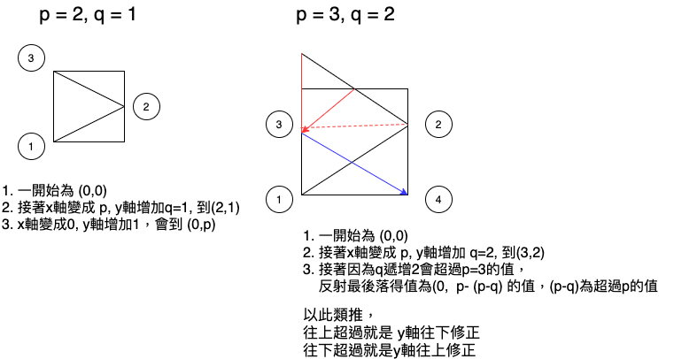

# 858. Mirror Reflection (medium)

There is a special square room with mirrors on each of the four walls.  Except for the southwest corner, there are receptors on each of the remaining corners, numbered 0, 1, and 2.

The square room has walls of length p, and a laser ray from the southwest corner first meets the east wall at a distance q from the 0th receptor.

Return the number of the receptor that the ray meets first.  (It is guaranteed that the ray will meet a receptor eventually.)

 
Example 1:
```
Input: p = 2, q = 1
Output: 2
Explanation: The ray meets receptor 2 the first time it gets reflected back to the left wall.
```


Note:

1 <= p <= 1000
0 <= q <= p

## 想法



## code

### cpp

```cpp=
class Solution {
public:
  // reflection 接收3個參數：  1. 目前y的位置，2.要往右邊還是左邊, 3. 往上還是往下
// 回傳會有3個資訊 [0]=目前是在左側，或右側 [1] 是往上發射還是往下 [2]目前y軸的位置 (x軸可透過 [0]的左側或右側來判斷)
void reflection(int pos[], bool &isRight, bool &isUp, int p, int q) {
    if (isRight) {
        pos[0] = p;
    } else {
        pos[0] = 0;
    }

    if (isUp) {
        pos[1] = pos[1] + q;
    } else {
        pos[1] = pos[1] - q;
    }
}

// 如果 p為 n,  2: (0,n) 1: (n,n), 0: (n,0)
int mirrorReflection(int p, int q) {
    // 初始位置為 (0,0) (x,y)
    int pos[] = {0,0};
    bool isRight = true;
    bool isUp = true;
    for(;;) {
        // 進行反射
        reflection(pos, isRight, isUp, p, q);


        if (pos[0] == 0 && pos[1] == p)
            return 2;
        if (pos[0] == p && pos[1] == p)
            return 1;
        if (pos[0] == p && pos[1] == 0)
            return 0;

        // 都沒有符合，判斷下次要折射的方向

        // 若已經是超過上方
        if (pos[1] > p) {
            int offset = pos[1] - p;
            pos[1] = p - offset;
            if (isRight) {
                pos[0] = p;
            } else {
                pos[0] = 0;
            }
            isUp = !isUp;
        }
        // 超過下方
        if (pos[1] < 0) {
            int offset = -(pos[1]);
            pos[1] = offset;
            isUp = !isUp;
        }
        isRight = !isRight;
    }

    return 0;
}

};
```

```
Submission Detail
69 / 69 test cases passed.
Status: Accepted
Runtime: 0 ms
Memory Usage: 6.1 MB
```